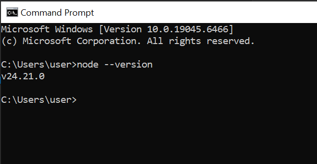
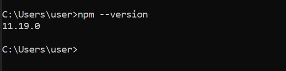
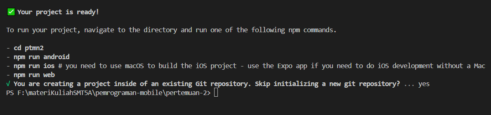
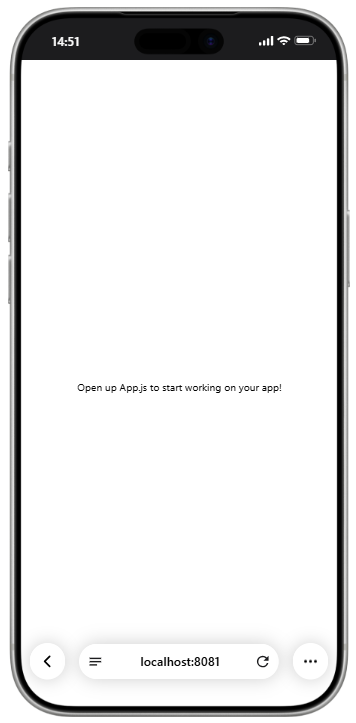

# Praktikum Menyiapkan dan Memulai Pemrograman Mobile (React Native) #

### Tujuan Pembelajaran ###
Mahasiswa mampu:
1. Menyiapkan dan Memulai Pemrograman Mobile (React Native)
2. Membuat Aplikasi Mobile (React Native)
3. Membuat CV sederhana dengan React Native

### Materi Pembelajaran ###
1. Menyiapkan dan memulai Pemrograman Mobile (React Native)
- Install Interpreter Node.JS
- Download dan install node.js di alamat https://nodejs.org/en/download
- konfirmmasi versi node.js
- node -v

 

- konfirmasi versi npm
- npm -v

 

2. Membuat Aplikasi Mobile (React Native)
- Untuk Referensi Dokumentasi Resmi milik Expo
- https://docs.expo.dev/
- untuk Referensi Dokumentasi Resmi milik React Native
- https://reacnative.dev/
- Memulai membuat projek baru dengan Framework Espo Go
- npx create-expo-app ptmn2 --template blank

3. Menjalankan Aplikasi Mobile (React Native)
- cd ptmn2
- npx expo start
- install Expo go via playstore atau app store
- install Expo go via app store
- Buka dan Scan QR Code Via Expo Go
- Running via Web Browser Emulator
- ctrl+c untuk menghetikan server
- sebelumnya install (npx expo install react-dom react-native-web)
- npx expo start --web

4. Tugas Praktikum Pemrograman Mobile (React Native)
- Menambagkan CV sederhana dengan React Native 
- Nama Lengkap
- NIM
- Asal Sekolah
- Cita-cita
- Rencana mencapai cita-cita